# burncloud-database-download 项目函数架构总览

## 项目架构概述

此项目是一个下载任务数据库持久化层，采用分层架构设计，提供类型安全的数据访问接口。

## 整体架构流程图

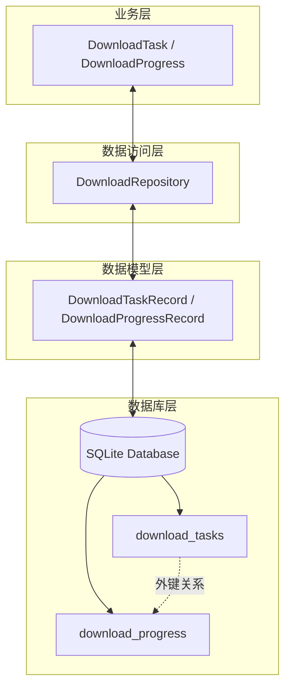

## 模块依赖关系图

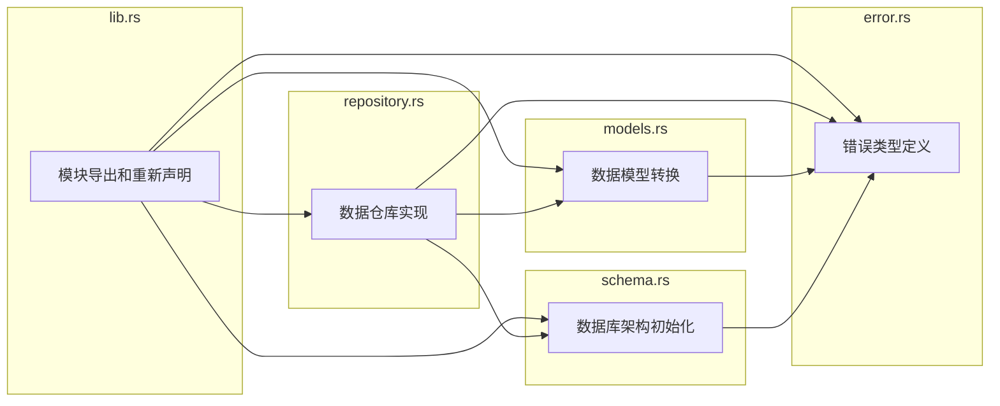

## 函数调用关系图

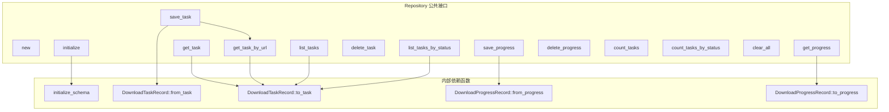

## 数据流转图

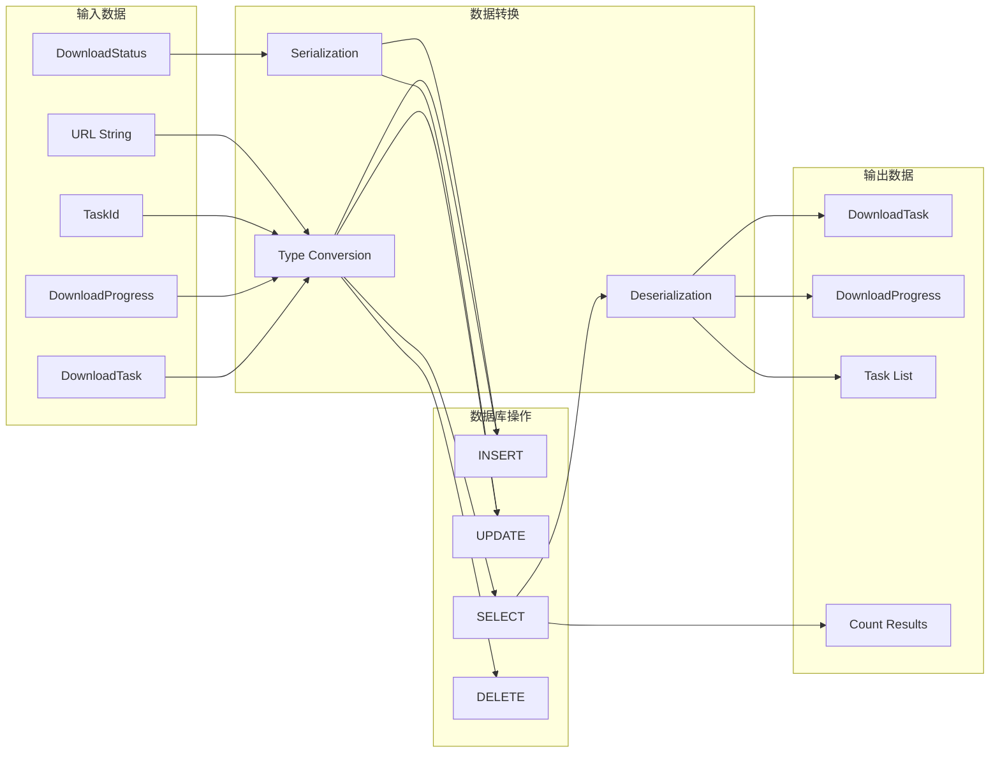

## 错误处理流程图

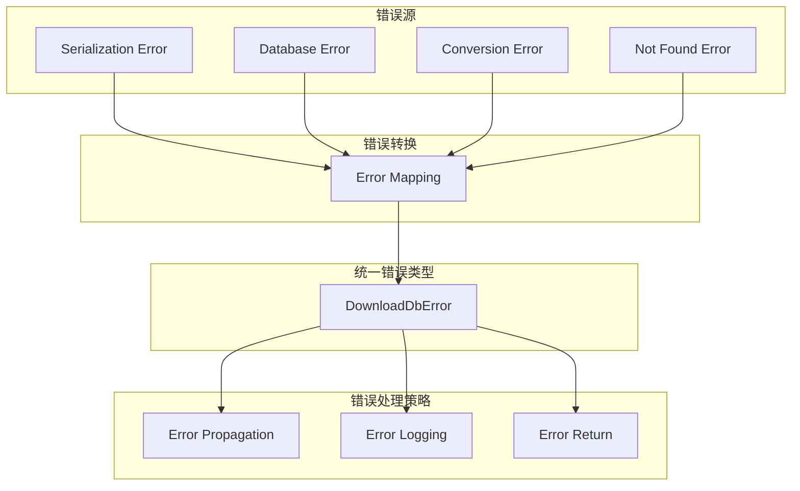

## 性能优化策略

### 数据库优化

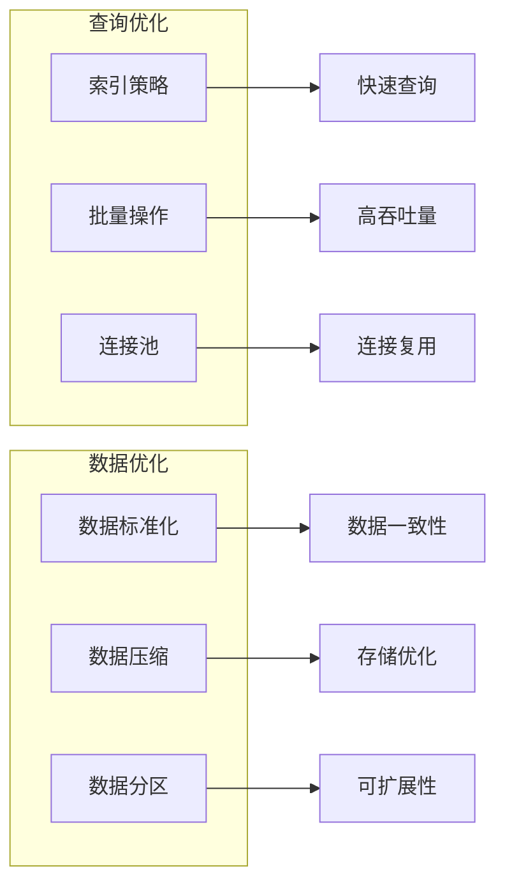

### 内存优化

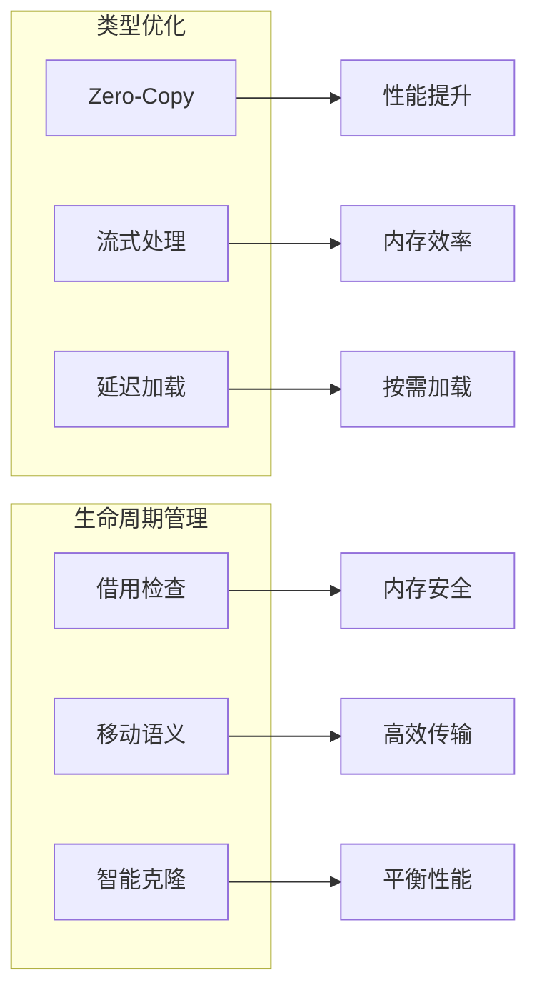

## 测试策略

### 测试层次结构

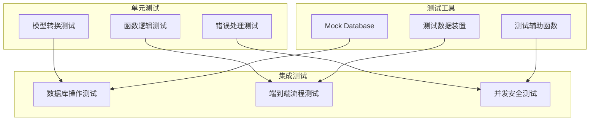

## 部署和监控

### 部署架构

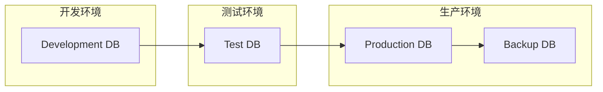

### 监控指标

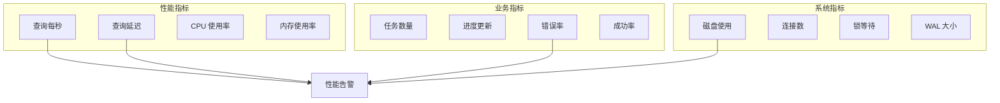

## 项目扩展规划

### 功能扩展

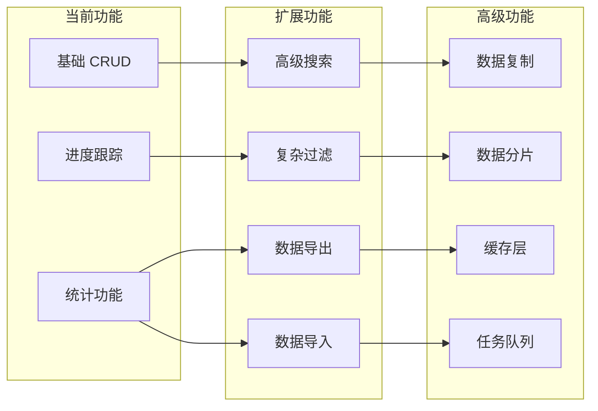

这个总览文档提供了项目的完整技术架构视图，包括了所有函数的关系、数据流转、错误处理、性能优化、测试策略和未来扩展规划。