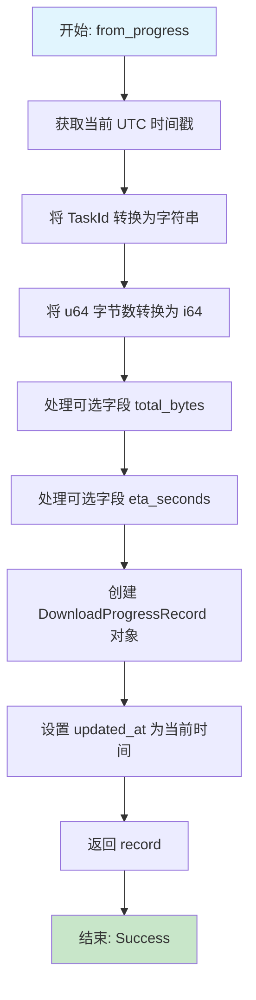
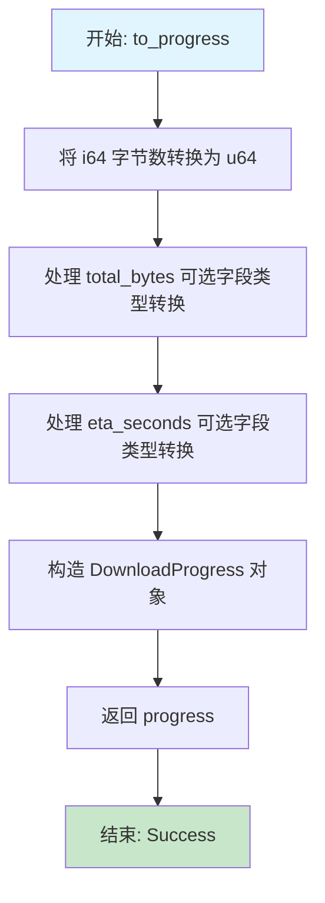

# 数据模型转换流程图

## DownloadTaskRecord 模块

### from_task 函数流程图

```mermaid
flowchart TD
    A[开始: from_task] --> B[获取当前 UTC 时间戳]
    B --> C[提取 task.id 并转换为字符串]
    C --> D[复制 task.url]
    D --> E[提取 task.target_path 并转换为字符串]
    E --> F[序列化 task.status 为 JSON]
    F --> G{序列化成功?}
    G -->|是| H[创建 DownloadTaskRecord 对象]
    G -->|否| I[返回序列化错误]
    H --> J[设置 created_at 和 updated_at 为当前时间]
    J --> K[返回 Ok(record)]
    I --> L[结束: Error]
    K --> M[结束: Success]

    style A fill:#e1f5fe
    style M fill:#c8e6c9
    style L fill:#ffcdd2
```

### to_task 函数流程图

```mermaid
flowchart TD
    A[开始: to_task] --> B[反序列化 status JSON 字符串]
    B --> C{反序列化成功?}
    C -->|是| D[将字符串 ID 转换为 TaskId]
    C -->|否| E[返回状态解析错误]
    D --> F{TaskId 转换成功?}
    F -->|是| G[将 Unix 时间戳转换为 SystemTime]
    F -->|否| H[返回 ID 格式错误]
    G --> I[构造 DownloadTask 对象]
    I --> J[返回 Ok(task)]
    E --> K[结束: Error]
    H --> K
    J --> L[结束: Success]

    style A fill:#e1f5fe
    style L fill:#c8e6c9
    style K fill:#ffcdd2
```

## DownloadProgressRecord 模块

### from_progress 函数流程图



### to_progress 函数流程图



## 数据转换关键点

### 类型安全转换
- **时间处理**: Unix 时间戳 ↔ SystemTime
- **数值转换**: u64 ↔ i64 (考虑数据库兼容性)
- **ID 转换**: TaskId ↔ String (序列化要求)
- **JSON 序列化**: DownloadStatus ↔ JSON String

### 错误处理策略
1. **序列化错误**: 通过 `serde_json::Result` 处理
2. **ID 格式错误**: 返回描述性错误字符串
3. **状态解析错误**: 包含原始错误信息的错误消息

### 时间处理机制
- 使用 `chrono::Utc::now().timestamp()` 获取当前时间
- 数据库存储 Unix 时间戳 (i64)
- 业务对象使用 `SystemTime`
- 通过 `UNIX_EPOCH + Duration` 进行转换