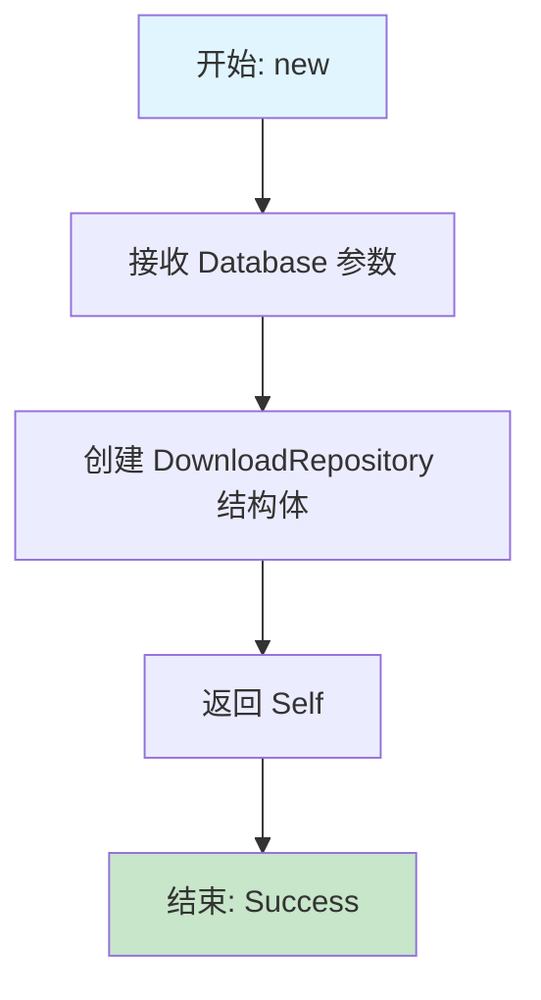
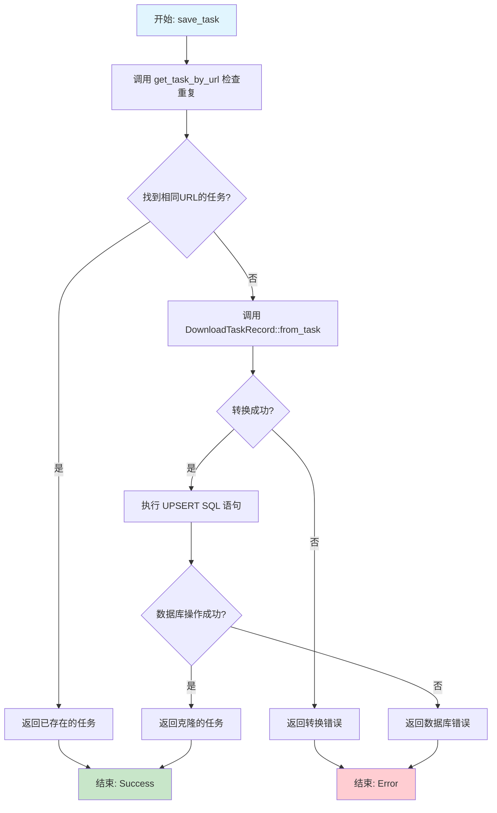
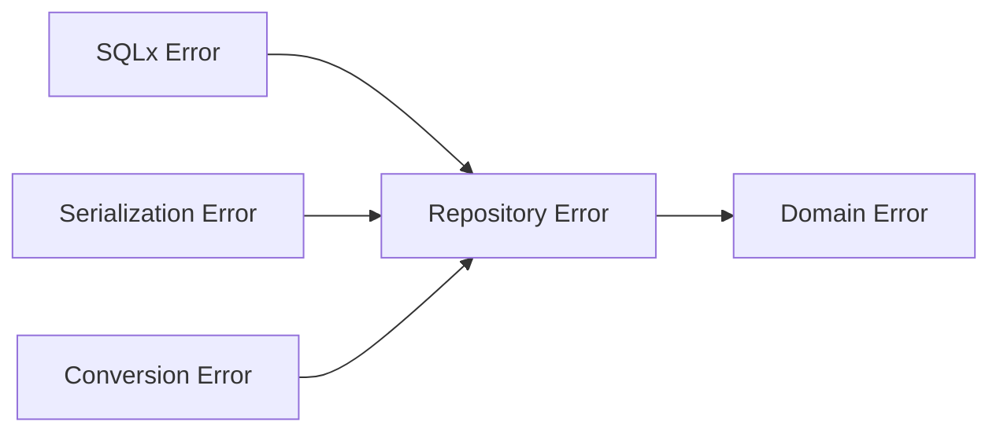

# 数据仓库层函数流程图

## 构造和初始化函数

### new 函数流程图



### initialize 函数流程图

```mermaid
flowchart TD
    A[开始: initialize] --> B[调用 initialize_schema]
    B --> C{Schema 初始化成功?}
    C -->|是| D[返回 Ok(())]
    C -->|否| E[传播错误]
    D --> F[结束: Success]
    E --> G[结束: Error]

    style A fill:#e1f5fe
    style F fill:#c8e6c9
    style G fill:#ffcdd2
```

## 任务管理函数

### save_task 函数流程图



### get_task_by_url 函数流程图

```mermaid
flowchart TD
    A[开始: get_task_by_url] --> B[执行 SELECT 查询]
    B --> C{查询成功?}
    C -->|否| D{错误类型是 RowNotFound?}
    D -->|是| E[返回 TaskNotFound 错误]
    D -->|否| F[返回 Sqlx 错误]
    C -->|是| G[调用 record.to_task()]
    G --> H{转换成功?}
    H -->|是| I[返回 Ok(task)]
    H -->|否| J[返回转换错误]
    I --> K[结束: Success]
    E --> L[结束: Error]
    F --> L
    J --> L

    style A fill:#e1f5fe
    style K fill:#c8e6c9
    style L fill:#ffcdd2
```

### get_task 函数流程图

```mermaid
flowchart TD
    A[开始: get_task] --> B[将 TaskId 转换为字符串]
    B --> C[执行 SELECT 查询]
    C --> D{查询成功?}
    D -->|否| E{错误类型是 RowNotFound?}
    E -->|是| F[返回 TaskNotFound 错误]
    E -->|否| G[返回 Sqlx 错误]
    D -->|是| H[调用 record.to_task()]
    H --> I{转换成功?}
    I -->|是| J[返回 Ok(task)]
    I -->|否| K[返回转换错误]
    J --> L[结束: Success]
    F --> M[结束: Error]
    G --> M
    K --> M

    style A fill:#e1f5fe
    style L fill:#c8e6c9
    style M fill:#ffcdd2
```

### list_tasks 函数流程图

```mermaid
flowchart TD
    A[开始: list_tasks] --> B[执行 SELECT ALL 查询]
    B --> C{查询成功?}
    C -->|否| D[返回数据库错误]
    C -->|是| E[使用迭代器映射记录]
    E --> F[调用 record.to_task() 批量转换]
    F --> G[收集结果到 Vec]
    G --> H{所有转换成功?}
    H -->|是| I[返回 Ok(tasks)]
    H -->|否| J[返回转换错误]
    I --> K[结束: Success]
    D --> L[结束: Error]
    J --> L

    style A fill:#e1f5fe
    style K fill:#c8e6c9
    style L fill:#ffcdd2
```

### list_tasks_by_status 函数流程图

```mermaid
flowchart TD
    A[开始: list_tasks_by_status] --> B[序列化 status 为 JSON]
    B --> C{序列化成功?}
    C -->|否| D[返回序列化错误]
    C -->|是| E[执行带状态过滤的查询]
    E --> F{查询成功?}
    F -->|否| G[返回数据库错误]
    F -->|是| H[批量转换记录]
    H --> I{转换成功?}
    I -->|是| J[返回 Ok(tasks)]
    I -->|否| K[返回转换错误]
    J --> L[结束: Success]
    D --> M[结束: Error]
    G --> M
    K --> M

    style A fill:#e1f5fe
    style L fill:#c8e6c9
    style M fill:#ffcdd2
```

### delete_task 函数流程图

```mermaid
flowchart TD
    A[开始: delete_task] --> B[将 TaskId 转换为字符串]
    B --> C[执行 DELETE SQL 语句]
    C --> D{删除成功?}
    D -->|是| E[返回 Ok(())]
    D -->|否| F[返回数据库错误]
    E --> G[结束: Success]
    F --> H[结束: Error]

    style A fill:#e1f5fe
    style G fill:#c8e6c9
    style H fill:#ffcdd2
```

## 进度管理函数

### save_progress 函数流程图

```mermaid
flowchart TD
    A[开始: save_progress] --> B[调用 DownloadProgressRecord::from_progress]
    B --> C[执行 UPSERT SQL 语句]
    C --> D{数据库操作成功?}
    D -->|是| E[返回 Ok(())]
    D -->|否| F[返回数据库错误]
    E --> G[结束: Success]
    F --> H[结束: Error]

    style A fill:#e1f5fe
    style G fill:#c8e6c9
    style H fill:#ffcdd2
```

### get_progress 函数流程图

```mermaid
flowchart TD
    A[开始: get_progress] --> B[将 TaskId 转换为字符串]
    B --> C[执行 SELECT 查询]
    C --> D{查询成功?}
    D -->|否| E{错误类型是 RowNotFound?}
    E -->|是| F[返回 TaskNotFound 错误]
    E -->|否| G[返回 Sqlx 错误]
    D -->|是| H[调用 record.to_progress()]
    H --> I[返回 Ok(progress)]
    I --> J[结束: Success]
    F --> K[结束: Error]
    G --> K

    style A fill:#e1f5fe
    style J fill:#c8e6c9
    style K fill:#ffcdd2
```

### delete_progress 函数流程图

```mermaid
flowchart TD
    A[开始: delete_progress] --> B[将 TaskId 转换为字符串]
    B --> C[执行 DELETE SQL 语句]
    C --> D{删除成功?}
    D -->|是| E[返回 Ok(())]
    D -->|否| F[返回数据库错误]
    E --> G[结束: Success]
    F --> H[结束: Error]

    style A fill:#e1f5fe
    style G fill:#c8e6c9
    style H fill:#ffcdd2
```

## 统计和管理函数

### count_tasks 函数流程图

```mermaid
flowchart TD
    A[开始: count_tasks] --> B[执行 COUNT 查询]
    B --> C{查询成功?}
    C -->|是| D[从结果行提取 count 值]
    C -->|否| E[返回数据库错误]
    D --> F[返回 Ok(count)]
    F --> G[结束: Success]
    E --> H[结束: Error]

    style A fill:#e1f5fe
    style G fill:#c8e6c9
    style H fill:#ffcdd2
```

### count_tasks_by_status 函数流程图

```mermaid
flowchart TD
    A[开始: count_tasks_by_status] --> B[执行 GROUP BY 查询]
    B --> C{查询成功?}
    C -->|是| D[遍历结果行]
    C -->|否| E[返回数据库错误]
    D --> F[提取 status 和 count 值]
    F --> G[构造元组并收集到向量]
    G --> H[返回 Ok(results)]
    H --> I[结束: Success]
    E --> J[结束: Error]

    style A fill:#e1f5fe
    style I fill:#c8e6c9
    style J fill:#ffcdd2
```

### clear_all 函数流程图

```mermaid
flowchart TD
    A[开始: clear_all] --> B[删除 download_progress 表数据]
    B --> C{进度表清理成功?}
    C -->|否| D[返回数据库错误]
    C -->|是| E[删除 download_tasks 表数据]
    E --> F{任务表清理成功?}
    F -->|是| G[返回 Ok(())]
    F -->|否| D
    G --> H[结束: Success]
    D --> I[结束: Error]

    style A fill:#e1f5fe
    style H fill:#c8e6c9
    style I fill:#ffcdd2
```

## 关键设计模式

### Repository 模式
- 封装所有数据访问逻辑
- 提供统一的错误处理
- 隐藏底层数据库实现细节

### UPSERT 模式
- 使用 `ON CONFLICT DO UPDATE` 处理插入/更新
- 保证数据一致性
- 简化客户端逻辑

### 错误传播链


### 类型转换安全
- 业务对象 ↔ 数据库记录
- 统一的转换函数
- 错误安全的类型映射