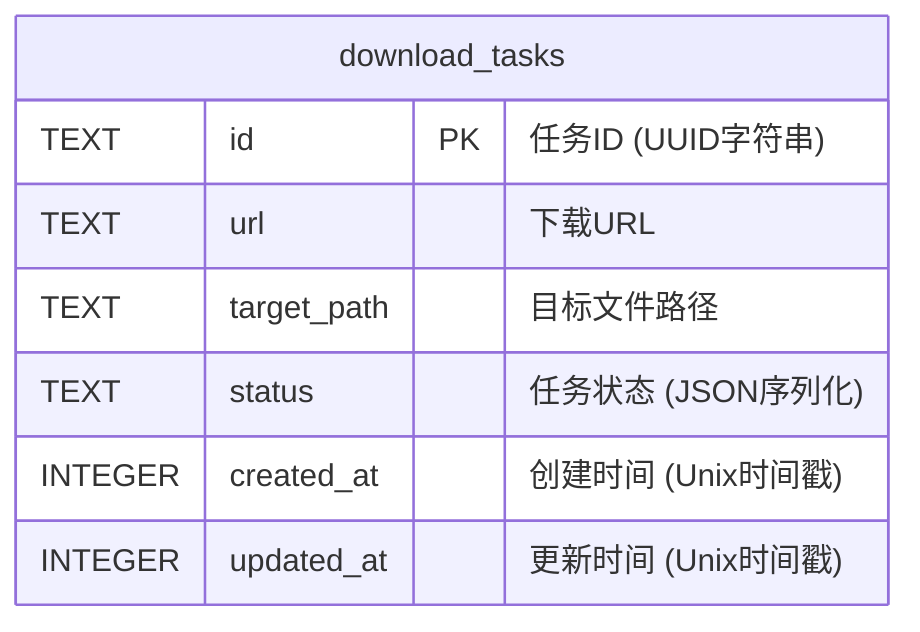
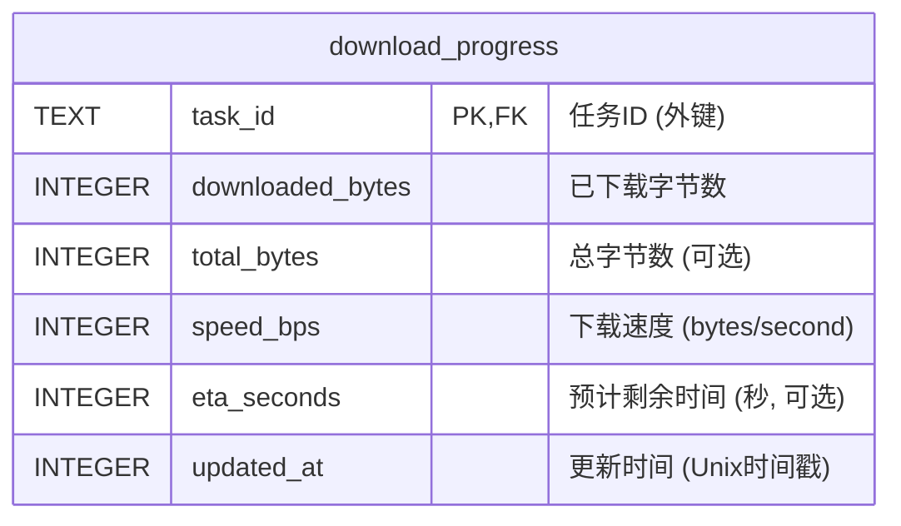
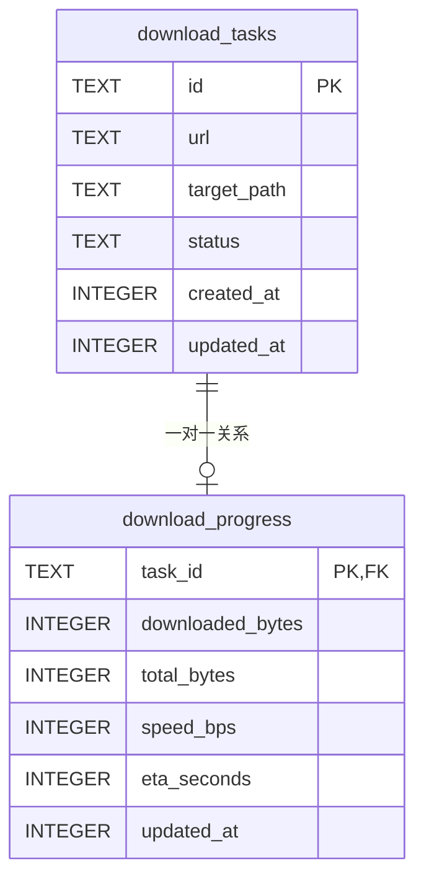
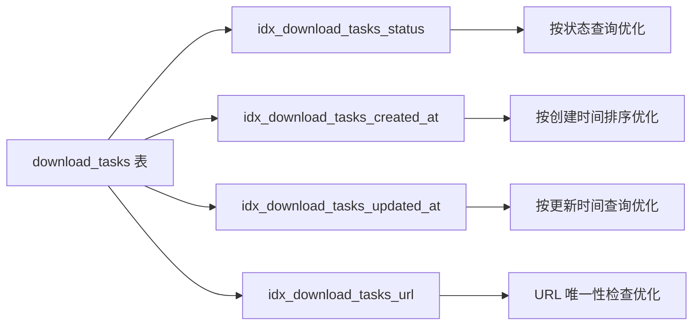

# 数据库架构初始化流程图

## initialize_schema 函数流程图

```mermaid
flowchart TD
    A[开始: initialize_schema] --> B[执行 CREATE_DOWNLOAD_TASKS_TABLE]
    B --> C{任务表创建成功?}
    C -->|是| D[执行 CREATE_DOWNLOAD_PROGRESS_TABLE]
    C -->|否| E[返回数据库错误]
    D --> F{进度表创建成功?}
    F -->|是| G[执行 CREATE_INDEXES]
    F -->|否| E
    G --> H{索引创建成功?}
    H -->|是| I[返回 Ok(())]
    H -->|否| E
    E --> J[结束: Error]
    I --> K[结束: Success]

    style A fill:#e1f5fe
    style K fill:#c8e6c9
    style J fill:#ffcdd2
```

## 数据库表结构

### download_tasks 表设计



### download_progress 表设计



### 表关系图



## 索引策略

### 性能优化索引



## 数据库约束

### 外键约束
- `download_progress.task_id` → `download_tasks.id`
- 级联删除: `ON DELETE CASCADE`

### 数据完整性
- 主键约束确保记录唯一性
- 非空约束确保关键字段存在
- 外键约束确保引用完整性

## 初始化流程关键点

1. **表创建顺序**: 必须先创建主表 (download_tasks)，再创建从表 (download_progress)
2. **错误处理**: 任何步骤失败都会立即返回错误，不会继续执行
3. **幂等性**: 使用 `IF NOT EXISTS` 确保重复执行不会出错
4. **性能考虑**: 在表创建后立即创建索引，优化后续查询性能